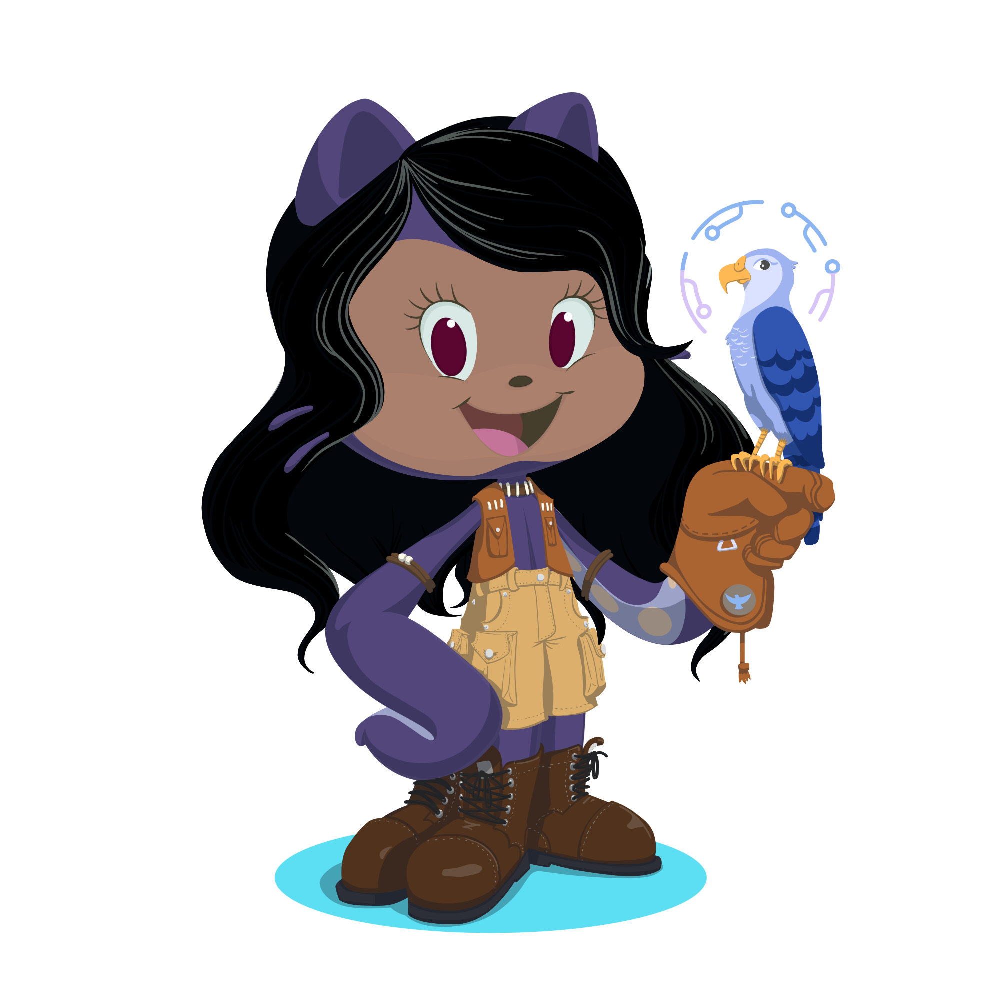

<h1>
    Hi 👋! My name is Debora !! Welcome to my Github profile
</h1>

Bem-vindo ao meu perfil no GitHub! Sou uma desenvolvedora apaixonada por tecnologia e inovação. Adoro resolver problemas complexos com soluções criativas e elegantes. Aqui você encontrará alguns dos projetos em que estou trabalhando e minhas contribuições para a comunidade.

## 🚀 Sobre Mim

- 🌱 Atualmente, estou estudando para ser uma desenvolvedora fullstack.
- 💼 Estou desenvolvendo algumas API .
- 💬 Pergunte-me sobre: JavaScript, Node.js, MongoDB, HTML, CSS , Linux , Aws , Mysql, Python.
- 📫 Como me encontrar: [LinkedIn](https://www.linkedin.com/in/d%C3%A9bora-la%C3%ADs-506226229/) 

###

             

 
###

###

 

  
  
  
  
  
  
  
  
  
  
  
  
  
  
  
  
  

###
## 📈 Estatísticas do GitHub

<a href="https://github.com/Debora-Laiss">

---

Estou sempre aberta a novas oportunidades de colaboração e aprendizado. Se você tiver um projeto interessante ou apenas quiser bater um papo sobre tecnologia, sinta-se à vontade para entrar em contato!

###
###

